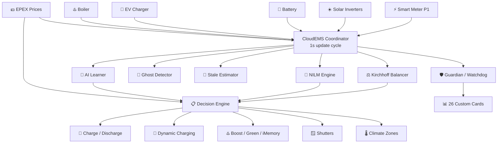
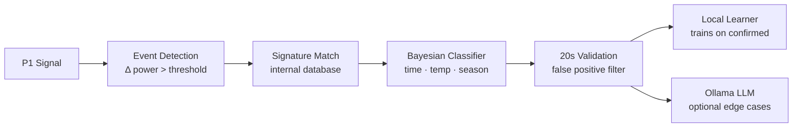
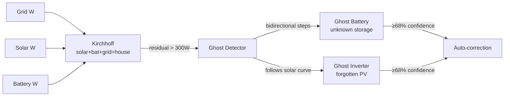
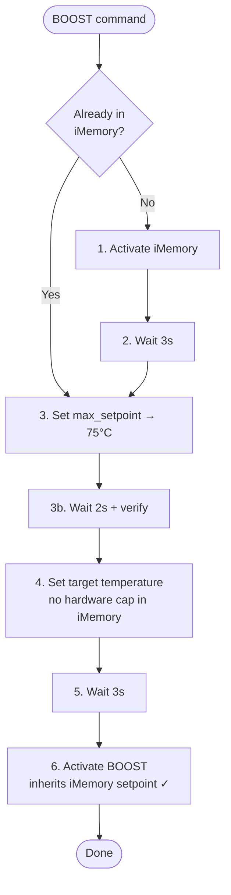
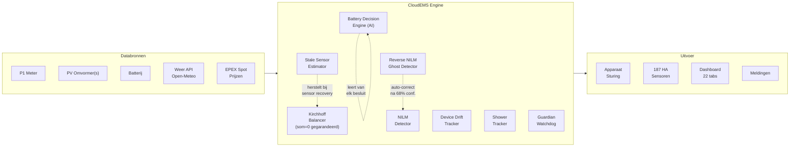

<div align="center">


# ⚡ CloudEMS
### Intelligent Energy Management for Home Assistant

[](https://github.com/cloudemsNL/ha-cloudems/releases)
[](https://github.com/hacs/integration)
[](https://www.home-assistant.io/)
[](LICENSE)
[](https://github.com/cloudemsNL/ha-cloudems/stargazers)

[](https://cloudems.eu)
[](https://cloudems.eu)
[](https://cloudems.eu)
[](https://cloudems.eu)

**[🌐 cloudems.eu](https://cloudems.eu) · [📖 Wiki](https://github.com/cloudemsNL/ha-cloudems/wiki) · [🐛 Issues](https://github.com/cloudemsNL/ha-cloudems/issues/new?template=bug_report.yml) · [☕ Buy Me a Coffee](https://buymeacoffee.com/smarthost9m)**

</div>

---

> [!NOTE]
> **v5.5.6 — Stable** — In daily production use. New in v5.5: Ghost Battery Detector, Stale Sensor Estimator, Shower Tracker, Off-Grid Survival Calculator, Dynamic Fuse Monitor, Energie Potentieel and Ariston iMemory bridge.
>
> **Dashboard:** Created automatically on first install. On some setups a **double restart** is required before the dashboard appears in the sidebar.

---

> [!TIP]
> ## 🚀 Setup wizard
>
> After installation open the **interactive setup wizard**:
> ```
> http://homeassistant.local:8123/local/cloudems/onboarding.html
> ```
> Guides you through P1, inverters, battery, EV, boiler and NILM hints step by step.

---

## What is CloudEMS?

CloudEMS transforms your smart meter into an **intelligent energy brain**. It observes, learns, predicts and acts — automatically aligning every flexible load in your home to the cheapest electricity, maximising solar self-consumption, and protecting circuits from overload.

```
┌──────────────────────────────────────────────────────────────────┐
│  Smart Meter (P1) ──► CloudEMS ──► Decisions ──► Your Devices   │
│       ↑                  │                           │           │
│       │              learns &                        │           │
│       └──── feedback ◄── predicts ◄── was it right? ┘           │
│                                                                  │
│         No cloud · No subscription · No data leaves home        │
└──────────────────────────────────────────────────────────────────┘
```

---

## Architecture



---

## Module overview

| Module | Status | Since | What it does |
|--------|--------|-------|--------------|
| 🧠 NILM Appliance Detection | ✅ Stable | v1.0 | Identifies devices from P1 signal alone |
| 💰 EPEX Dynamic Pricing | ✅ Stable | v1.0 | Day-ahead prices NL/DE/AT/ENTSO-E |
| 🔋 Battery Optimisation | ✅ Stable | v2.0 | EPEX-driven charge/discharge schedule |
| ⚡ Peak Shaving | ✅ Stable | v2.0 | 15-min capacity tariff management |
| ☀️ PV Forecast & Clipping | ✅ Stable | v3.0 | Self-learning solar forecast |
| 🚗 EV Charging + ERE | ✅ Stable | v3.0 | Dynamic current, session learner, V2H |
| 🪟 Roller Shutter Automation | ✅ Stable | v3.0 | Sun-aware automation |
| ♨️ Boiler Cascade Control | ✅ Stable | v4.0 | Multi-boiler, legionella, demand-boost |
| 🌡️ Climate Zone Intelligence | ✅ Stable | v4.0 | Pre-heat, COP tracking, EPEX compensation |
| 🛡️ Generator / ATS Backup | ✅ Stable | v4.6 | Auto-start, load limiting, TTS alerts |
| 🔌 V2H Vehicle to Home | ✅ Stable | v4.6 | EV as home battery |
| 👻 Ghost Battery Detector | ✅ Stable | v5.4 | Reverse NILM — finds unknown inverters/batteries |
| 🔧 Stale Sensor Estimator | ✅ Stable | v5.4 | Estimates offline sensors via correlation |
| 🚿 Shower Tracker | ✅ Stable | v5.5 | Detects showers, calculates liters/cost/CO₂ |
| ⚡ Off-Grid Survival | ✅ Stable | v5.5 | Hours of autonomy at 4 scenarios |
| 🔌 Dynamic Fuse Monitor | ✅ Stable | v5.5 | Live phase load with headroom |
| 🤖 AI Self-learning BDE | ✅ Stable | v5.5 | Price thresholds adapt from real outcomes |
| 🎮 Demo Mode | ✅ Stable | v5.4 | 48× time simulation, no real data touched |

---

## Feature deep-dives

<details>
<summary><b>🧠 NILM — Appliance detection without extra hardware</b></summary>
<br>

Non-Intrusive Load Monitoring identifies individual appliances from the aggregate grid power signal alone.

**Detection pipeline:**



**Key capabilities:**
- Adaptive threshold via rolling 80th-percentile — reaches ~10W sensitivity
- Smart Plug Anchoring (Shelly/Tasmota/ESPHome) lifts accuracy to ~85%+
- Phase auto-detection — which L1/L2/L3 per device, locked after 3 observations
- Manual phase override via L1/L2/L3 buttons, persists across restarts
- 7×24 weekly usage profiles with unusual-time alerts
- HMM session tracking for multi-state appliances
- Drift detection — alerts when a device consistently draws more than its baseline
  - Kitchen appliances (coffee maker, kettle) exempt — their power varies naturally

> 📸 `docs/images/nilm-dashboard.png`

</details>

<details>
<summary><b>👻 Ghost Battery Detector & Reverse NILM</b></summary>
<br>

Detects **unknown batteries and inverters** purely from the Kirchhoff energy residual.



**Ghost Inverter** — unexplained production that follows the solar irradiance curve → unconfigured inverter.

**Ghost Battery** — bidirectional power steps correlated with solar/grid → unknown home battery.

Auto-corrects at ≥68% confidence (min 50 observations, 2+ days). Deactivates within 3 ticks after configuration.

> 📸 `docs/images/ghost-detector.png`

</details>

<details>
<summary><b>🔧 Stale Sensor Estimator — Multi-inverter correlation</b></summary>
<br>

When a configured sensor goes offline, CloudEMS **estimates its value** instead of showing 0W.

**Three estimation layers:**

| Layer | Method | Confidence | Requires |
|-------|--------|-----------|----------|
| 1 | Export inference | 88% instant | Just P1 data |
| 2 | Hourly profile × weather | rises with days | 3+ obs/hour |
| 3 | Inverter correlation | 86–100% | 10+ paired samples |

**Multi-inverter correlation** — learns the **per-hour ratio** between inverters. West orientation lags East:

```
10:00  Growatt East 96% · GoodWe West  4%   (East on peak)
14:00  Growatt East 56% · GoodWe West 44%   (West catching up)
16:00  Growatt East 28% · GoodWe West 72%   (West on peak)
```

Scales automatically to 5+ inverters, 2 stale simultaneously.

</details>

<details>
<summary><b>🚿 Shower Tracker</b></summary>
<br>

Detects shower sessions from **boiler temperature drop** and calculates:

| Metric | Example |
|--------|---------|
| Duration | 8.3 min |
| Liters used | 66 L |
| Energy | 2.1 kWh |
| Cost | €0.55 |
| CO₂ | 840 g |
| Flow rate | 7.9 L/min |
| Rating | ✅ Prima douche |

Fun ratings: ⚡ Military shower (<5 min) · ✅ Good (5–10 min) · ⚠️ Long (10–15 min) · 🚨 Very long (>15 min + bathtub comparison)

History bar chart, 7-day averages and total liters as % of an Olympic swimming pool.

Live session banner while showering in the Boiler card Douche tab.

> 📸 `docs/images/shower-tracker.png`

</details>

<details>
<summary><b>♨️ Ariston iMemory Bridge</b></summary>
<br>

Ariston heat pump boilers have a hardware cap of 53°C in BOOST mode and do not accept direct temperature changes. CloudEMS uses iMemory as a stepping stone:



Works for **all setpoints** — even ≤53°C, because BOOST never accepts `set_temperature` directly. Verify/retry logic confirms the boiler actually reached the desired state, with max 4 retries and exponential backoff.

</details>

<details>
<summary><b>⚡ Off-Grid Survival Calculator</b></summary>
<br>

*"If the grid goes down right now, how long can I run my home?"*

```
🍳 Essential only  (0.2kW) ████████████████████ 24h+
🏠 Normal home     (0.5kW) ████████████████     16h  +3h ☀️
❄️ With airco      (2.0kW) ████████             8h   +1h ☀️
🚗 With EV         (4.2kW) ████                 4h
                   
█ Battery   ░ PV today remaining    24h bar = 1 day
```

Colour-coded: 🟢 ≥8h · 🟡 ≥4h · 🔴 <4h

> 📸 `docs/images/offgrid-calculator.png`

</details>

<details>
<summary><b>🔋 Energie Potentieel</b></summary>
<br>

Answers: *"What can I still do with my available energy?"*

Two sections — battery and remaining PV today:

```
🔋 Battery  78% · 7.8 kWh          ☀️ PV today  still 9.2 kWh
────────────────────────            ────────────────────────────
🍳 Inductie koken    3×             🍳 Inductie koken    4×
☕ Koffie            32×            ☕ Koffie            38×
🍽 Vaatwasser         4×            💡 Lampen            30u
💡 Lampen            26u            ❄️ Airco koelen      6u
❄️ Airco koelen       5u            🚗 Auto 10 km        4×
🚿 Douche (8 min)     4×            🚲 E-bike            2×
```

Shower count from live Shower Tracker (actual boiler temperature).

</details>

<details>
<summary><b>🔌 Dynamic Fuse Monitor</b></summary>
<br>

Live per-phase current monitoring — know before a fuse trips.

```
L1  ████████████████░░░░  16.2A / 25A   65%   3.7kW  ✓ EV
L2  █████████████████████  21.8A / 25A  87% ⚠ 5.0kW  ✓ Inductie
L3  ████░░░░░░░░░░░░░░░░░   4.1A / 25A  16%   0.9kW  ✓ EV (3.7kW)
    │                   │
    warn 80%          alert 95%
    
Actieve apparaten:
  Wasmachine     1.8kW · L2
  Vaatwasser     1.6kW · L2
  Inductiekook   2.0kW · L1
```

> 📸 `docs/images/fuse-monitor.png`

</details>

<details>
<summary><b>💰 EPEX Prices & Cost Calculator</b></summary>
<br>

Day-ahead electricity prices for NL, DE, AT (no API key) and all ENTSO-E areas (free key).

**Smart negative price alerts** — only fires when the **all-in price including tax and VAT** is negative.

**Cost Calculator card** shows:
- Current tariff (colour-coded green/yellow/red)
- Today's cost + PV savings
- This week vs last week (kWh delta)
- This month with €/day average
- This year with €/month projection

</details>

<details>
<summary><b>🛡️ Reliability & Self-healing</b></summary>
<br>

**Kirchhoff Balancer** — `solar + battery + grid = house` enforced every tick. Triggers immediately on large unexplained export (>500W). Uses `last_change_ts` so inverter keepalive packets don't trigger false corrections.

**Guardian / Watchdog** — after 3 consecutive errors: exponential backoff reload (30s → 60s → max 1h).

**Error counters** in version card:
- **Fouten (gem. 7d)** — goes to 0 after 7 clean days ✓
- **Fouten (uptime)** — resets every restart
- **Fouten (vandaag)** — resets at midnight

**Stale sensor fallback** — sensor offline? CloudEMS estimates via multi-inverter correlation, hourly profile or thermal model. Instantly restored when sensor comes back.

</details>

<details>
<summary><b>🎮 Demo Mode</b></summary>
<br>

Complete simulation at **48× time acceleration** — one full day in 30 minutes.

Virtual sensors with realistic curves: solar, battery, boiler, EV. Kirchhoff guaranteed. AI learning paused. Real data untouched.

A forgotten 1.5kW inverter appears live via the Ghost Detector demo after 2 simulated minutes.

Enable: CloudEMS → Configure → System & Communication → 🎮 Demo mode

</details>

---

## Dashboard — 26 Custom Cards

> 📸 `docs/images/dashboard-overview.png`

| Tab | Content |
|-----|---------|
| 🏠 Overzicht | Energy flow, alerts ticker, energie potentieel, status |
| ☀️ Solar & PV | Inverter status, clipping, forecast, ROI, PV health |
| 🔋 Batterij | EPEX schedule, SoC, State of Health, off-grid survival |
| 🌡️ Warm Water | Boiler groups, shower tracker, douche tab, demand-boost |
| 🚗 EV & Mobiliteit | Dynamic charging, session learner, V2H, ERE certificates |
| 🚲 E-bike & Scooter | Micro-mobility sessions, vehicle profiles |
| 🏊 Zwembad | Pool filtration + heating |
| ❄️ Klimaat | Zone overview, pre-heat, zone cost tracking |
| 🪟 Rolluiken | Shutter card v3.0 with dropdown detail |
| 💡 Lampen | Circulation control, behaviour pattern |
| 💶 Prijzen & Kosten | EPEX chart, cheap-hours, bill simulator, kosten calculator |
| 🧠 NILM Apparaten | Detected devices, schedule profiles, time heatmap |
| ⚙️ NILM Beheer | Live activity, device list, models, cleanup |
| 💡 Advies | Energy demand, savings tips |
| 🧬 Zelflerend | Weekly insights, learning progress, anomaly detail |
| 🔬 Diagnose | Watchdog, fuse monitor, sensor sanity, EMA diagnostics |
| ⚙️ Configuratie | Module toggles, boiler groups, NILM settings |
| 🏗️ Architectuur | Live system architecture diagram |

### New cards in v5.5

| Card | Description |
|------|-------------|
| `cloudems-alerts-ticker-card` | Rotating alerts, priority sorted critical→warning→info |
| `cloudems-energie-potentieel-card` | Battery + PV as universal appliance calculator |
| `cloudems-offgrid-card` | Hours autonomy at 4 consumption scenarios |
| `cloudems-fuse-monitor-card` | Live phase currents with headroom + active devices |
| `cloudems-kosten-calculator-card` | Today / week / month / year costs + PV savings |

---

## Installation

### Via HACS (recommended)

1. Open **HACS** → **Integrations** → ⋮ → **Custom repositories**
2. Add `https://github.com/cloudemsNL/ha-cloudems` → category **Integration**
3. Search **CloudEMS** → **Download**
4. Restart Home Assistant
5. **Settings** → **Devices & Services** → **+ Add Integration** → search **CloudEMS**
6. Follow the setup wizard

### Manual

Download the [latest release](https://github.com/cloudemsNL/ha-cloudems/releases/latest), extract and copy `custom_components/cloudems/` to `config/custom_components/`. Restart HA.

---

## Requirements

| | |
|---|---|
| Home Assistant | 2024.1.0+ |
| Smart meter | P1/DSMR/HomeWizard/Shelly EM or any power sensor |
| Python | 3.11+ (built into HA) |
| Ollama | Optional — local LLM for NILM classification |

---

## Support CloudEMS

CloudEMS is **completely free**. If it saves you money — please consider:

<div align="center">

### 👉 [buymeacoffee.com/smarthost9m](https://buymeacoffee.com/smarthost9m) ☕

⭐ Star this repo · 🐛 [Report bugs](https://github.com/cloudemsNL/ha-cloudems/issues/new?template=bug_report.yml) · 💡 [Request features](https://github.com/cloudemsNL/ha-cloudems/issues/new?template=feature_request.yml)

</div>

---

© 2026 CloudEMS · [cloudems.eu](https://cloudems.eu) · [License](LICENSE)

---

<div align="center">
<sub>Home Assistant energy management · NILM · EPEX spot prices · dynamic EV charging · peak shaving · phase balancing · grid congestion · netcongestie · capaciteitstarief · ERE certificaten · saldering simulator · ghost battery detector · stale sensor estimator · shower tracker · off-grid survival · fuse monitor · Ariston iMemory · reverse NILM · multi-inverter correlation · Kirchhoff balancer · demo mode · self-learning AI · battery decision engine · energie potentieel · kosten calculator · P1 · DSMR · heat pump COP · boiler cascade · generator ATS MTS · rolluiken · legionella · demand boost · energy budget</sub>
</div>
</tr>
<tr>
<td width="50%" valign="top">

### 🚗 EV & Mobiliteit
- **Dynamische stroomregeling** — PID controller solar/goedkoop/fase
- **Trip Planner** — laadt exact genoeg voor je volgende rit
- **ERE certificaten** — RED3/NEa tracking voor NL inboekdienst
- **V2H** — EV als thuisbatterij bij dure uren (Wallbox Quasar 2)
- **E-bike sessies** — per voertuig profiel en statistieken

</td>
<td width="50%" valign="top">

### 📊 Dashboard & Inzichten
- **Alerts Ticker** — roterende meldingen kritiek→waarschuwing→info
- **Kosten Calculator** — tarief, dag/week/maand/jaar + PV besparing
- **Shower Tracker tab** — live sessie, geschiedenis, fun facts
- **Energie Potentieel** — koffie, koken, lampen, airco, douche...
- **22 volledig gestylde dashboard tabs**

</td>
</tr>
</table>

---

## 🏗️ Architecture



---

## 🛡️ Fault Tolerance — het systeem dat niet stopt

CloudEMS is ontworpen om te blijven werken, ook als sensoren, APIs of het netwerk uitvallen.

### Stale Sensor Estimator
Als een omvormer offline gaat, stopt CloudEMS **niet** met werken. Het systeem schat de productie via drie lagen:

1. **Multi-omvormer correlatie per uur** — West-dak stale? Growatt Oost werkt nog → GoodWe = totaal × geleerde uurverhouding (West ijlt na op Oost, ratio op 10:00 ≠ ratio op 15:00)
2. **Geleerd uur-profiel × weerfactor** — historisch patroon gecorrigeerd voor bewolking
3. **Export inference** — grid exporteert meer dan bekende productie → onverklaard vermogen berekend

Het systeem herstelt automatisch zodra de sensor terugkomt.

### Ghost Battery Detector (Reverse NILM)
Vergeten omvormer op het dak? Onbekende batterij in de meterkast? CloudEMS detecteert dit automatisch via Kirchhoff-residual analyse:

- **Ghost Inverter** — onverklaard productievermogen dat de zonnecurve volgt
- **Ghost Battery** — bidirectionele vermogensstappen gecorreleerd met solar/grid
- Auto-correctie na ≥68% confidence (min. 50 observaties, 2+ dagen)

### Kirchhoff Balancer
Elke cyclus geldt: `solar + grid = house + battery`. CloudEMS garandeert deze som altijd. P1 grid-data wordt **nooit** overschreven — het is het anker van het systeem.

---

## ⚡ Off-Grid Survival Calculator

Hoeveel uur ben je autonoom als het net uitvalt?

```
🔋 Batterij 78% · 7.8 kWh

  💡 Alleen essentieel    ████████████████████░░░  39 uur  + 12 uur ☀️
  🏠 Normaal thuis        ████████░░░░░░░░░░░░░░░   9 uur  +  4 uur ☀️
  ❄️ Met airco            ████░░░░░░░░░░░░░░░░░░░   4 uur  +  2 uur ☀️
  🚗 Met EV laden         █░░░░░░░░░░░░░░░░░░░░░░   1 uur
```

Live berekend op basis van huidige batterij-SoC, capaciteit en verwachte PV vandaag.

---

## 🚿 Shower Tracker

CloudEMS detecteert douche-sessies via boilertemperatuur-daling en berekent automatisch:

| Metric | Voorbeeld |
|--------|-----------|
| ⏱ Duur | 8.3 min |
| 💧 Liters | 66 L |
| 🚿 Flow | 8.0 L/min |
| ⚡ Energie | 1.847 kWh |
| 💶 Kosten | €0.47 |
| 🌱 CO₂ | 739 g |
| 🏆 Beoordeling | ✅ Prima douche — 2 min korter dan gemiddeld 👍 |

Geschiedenis, gemiddelden en fun facts zichtbaar in de boiler kaart → 🚿 Douche tab.

---

## 🔌 Groepenkast Bewaking

Live monitoring van alle drie fasen met vrije capaciteit per fase:

```
L1  ████████████░░░  68%  15.6A / 23A     3.4kW
L2  ████████████████  89% ⚠️  20.5A / 23A  4.7kW
L3  ████░░░░░░░░░░░  22%   5.1A / 23A     1.2kW

Ruimte per fase:
  L1: 7.4A vrij  → ✓ EV (3.7kW) past nog
  L2: 2.5A vrij  → ✓ Koffie past nog
  L3: 17.9A vrij → ✓ EV (3.7kW) past nog
```

---

## 🏗️ Architecture — Future-proof by design

CloudEMS is gebouwd met één principe: **de logica volgt de data, niet de hardware**.

De huidige lokale engine draait volledig op jouw Home Assistant. De architectuur is echter van dag één ontworpen als een **modulaire pipeline** — elke module (NILM, AI, forecast, balancer) is onafhankelijk en spreekt via gedefinieerde interfaces.

Dit heeft een praktisch voordeel: rekenintensieve modules kunnen stap voor stap worden verplaatst naar een **dedicated inference layer** zonder dat de gebruikerservaring verandert. De sensordata blijft lokaal. De beslissingen komen terug via een vertrouwde API. Jouw HA blijft het commandocentrum.

> ℹ️ Wanneer een module naar de inference layer verhuist, blijft jouw installatie **minimaal X dagen volledig autonoom** draaien op de lokale cached modellen. Er is geen harde cloud-afhankelijkheid — CloudEMS degradeert graceful bij verbindingsverlies.

Deze architectuurkeuze maakt het ook mogelijk om in de toekomst **fleetwide leermodellen** te introduceren: patronen die op duizenden installaties zijn geleerd, maar nooit individuele gebruikersdata delen. Jouw huis leert van de hele vloot, maar niemand leert jouw huis kennen.

---

## 📊 Dashboard

Het meegeleverde dashboard heeft **22 volledig gestylde tabs**, gebouwd op custom JavaScript kaarten — geen externe frontend dependencies.

| Tab | Inhoud |
|-----|--------|
| 🏠 Overzicht | Live energiestroom, alerts ticker, energie potentieel, meldingen |
| ☀️ Solar & PV | Omvormer status, clipping, forecast, ROI, ghost detector |
| 🔋 Batterij | EPEX schema, SoC, State of Health, off-grid survival, kosten |
| 🌡️ Warm Water | Boiler groepen, ramp status, 🚿 douche tab, energie potentieel |
| 🚗 EV & Mobiliteit | Dynamisch laden, trip planner, ERE certificaten |
| 🚲 E-bike & Scooter | Micro-mobiliteit sessies, voertuig profielen |
| ❄️ Klimaat | Zone overzicht, pre-heat, EPEX compensatie |
| 🪟 Rolluiken | Shutter card v3.0 met dropdown detail |
| 💶 Prijzen & Kosten | EPEX grafiek, goedkoopste uren, bill simulator, kosten calculator |
| ⚡ Fasen | Per-fase stroom, groepenkast bewaking, piekschaving |
| 🧠 NILM Apparaten | Gedetecteerde apparaten, schema profielen, tijdheatmap |
| 💡 Advies | Energie vraag per subsysteem, besparingstips |
| 🔔 Meldingen | Alle actieve alerts met ticker |
| 🔬 Diagnose | Watchdog, sensor sanity, EMA diagnostics, fout tellers |
| ⚙️ Configuratie | Module toggles, boiler groepen, NILM instellingen |
| + 7 meer | Zwembad, lampen, ERE, zelflerend, architectuur, ... |

### Energie Potentieel widget

Batterij en PV als universele rekenmachine — direct zichtbaar in Overzicht en Warm Water:

```
🔋 Batterij  78% · 7.8 kWh          ☀️ Verwachte PV vandaag  nog 9.2 kWh
  🍳 Inductie koken    3×              🍳 Inductie koken    4×
  ☕ Koffie zetten    32×              ☕ Koffie zetten    38×
  🍽 Vaatwasser        4×              🚿 Douche (8 min)    9×
  💡 Lampen (huis)    26u              ❄️ Airco koelen      6u
  ❄️ Airco koelen      5u              💡 Lampen (huis)    30u
  🚿 Douche (8 min)    4×              🚗 Auto 10 km        4×
```

---

## ⚙️ Configuration wizard

The setup wizard guides you through all modules in grouped categories. Every step has a **← Back** button to return to the main menu without losing progress.

Available in 🇳🇱 Dutch · 🇬🇧 English · 🇩🇪 German · 🇫🇷 French.

| Category | Included sections |
|---|---|
| ⚡ Energie & Grid | Grid sensors, phase sensors, prices, budget, P1 advanced, generator/ATS |
| ☀️ Opwekking | PV inverters, clipping, EV, batteries |
| 🏠 Verbruik | Boiler controller, climate, shutters, pool, lamps |
| 🤖 Automatisering | NILM, AI, load shifting, cheap-hours switches |
| 🎮 Demo modus | Test alle functies in 48× tijdversnelling zonder echte data te raken |
| 🔧 Systeem | Mail reports, watchdog instellingen |

---

## 🧪 Demo modus

Wil je CloudEMS uitproberen zonder je eigen installatie te raken?

Activeer **Demo modus** via CloudEMS → Configureren → Systeem → 🎮 Demo modus. Het systeem simuleert een volledige dag in ~30 minuten (48× versnelling) met:

- Realistische PV curve, batterij cyclus, boiler en EV
- Kirchhoff-garantie voor alle 24 uur gesimuleerde data
- Ghost detector die na 2 minuten een vergeten omvormer "ontdekt"
- AI learning gepauzeerd — echte data volledig onaangetast

---

## 🔒 Privacy & Data

CloudEMS verwerkt uitsluitend data die al beschikbaar is binnen jouw Home Assistant installatie. Er wordt **geen** energie- of persoonsdata naar externe servers gestuurd.

- EPEX prijzen worden opgehaald als anonieme marktdata (geen account vereist)
- Open-Meteo weerdata: coördinaten worden per request meegestuurd, geen tracking
- Alle geleerde modellen, patronen en beslissingsgeschiedenis blijven lokaal opgeslagen

---

## 📦 Installation

### Via HACS (recommended)

1. Open **HACS** → **Integrations** → ⋮ → **Custom repositories**
2. Add `https://github.com/cloudemsNL/ha-cloudems` → category **Integration**
3. Search **CloudEMS** → **Download**
4. Restart Home Assistant
5. **Settings** → **Devices & Services** → **+ Add Integration** → **CloudEMS**
6. Follow the setup wizard

### Manual

Download the [latest release](https://github.com/cloudemsNL/ha-cloudems/releases/latest), extract, copy `custom_components/cloudems/` to `config/custom_components/`. Restart HA.

---

## 🤝 Support CloudEMS

CloudEMS is **completely free**. If it saves you money on your energy bill — please consider a small contribution.

<div align="center">

### 👉 [buymeacoffee.com/smarthost9m](https://buymeacoffee.com/smarthost9m) ☕

</div>

You can also support by starring ⭐ this repository, [reporting bugs](https://github.com/cloudemsNL/ha-cloudems/issues/new?template=bug_report.yml), or telling other HA users about CloudEMS.

---

## License

© 2026 CloudEMS · [cloudems.eu](https://cloudems.eu) · All rights reserved

---

<div align="center">
<sub>Keywords: Home Assistant energy management · NILM · EPEX spot · dynamic EV charging · peak shaving · phase balancing · grid congestion · netcongestie · capaciteitstarief · ERE certificaten · saldering simulator · solar curtailment · AI energy · ghost battery detector · stale sensor · shower tracker · off-grid survival · fuse monitor · energie potentieel · Ariston iMemory · Ollama AI · smart meter · P1 · DSMR · bill simulator · heat pump COP · boiler cascade · generator ATS MTS · rolluiken automatisering · legionella · reverse NILM · Kirchhoff balancer · self-healing sensors</sub>
</div>
